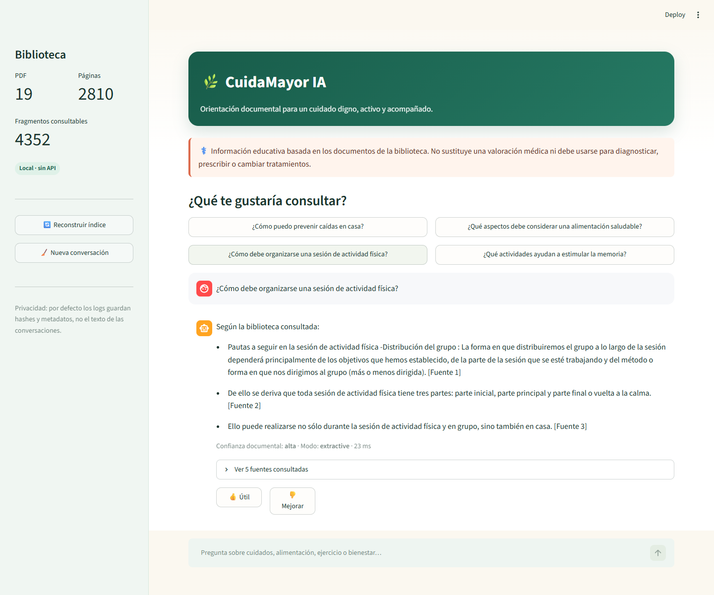
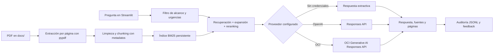

# 🌿 AAMIA — Apoyo al Adulto Mayor IA

Agente RAG en español para consultar una biblioteca documental sobre cuidado de personas adultas mayores: cuidados iniciales y cotidianos, alimentación, actividad física, movilidad, memoria y bienestar general.


> **Aviso:** AAMIA ofrece información educativa basada en los documentos cargados. No diagnostica, no prescribe y no sustituye una valoración médica. Ante una posible urgencia, indica contactar inmediatamente a los servicios de emergencia locales.



## Problema y objetivo

Familiares, cuidadores y equipos de apoyo suelen tener que buscar información en manuales extensos y dispersos. AAMIA transforma una colección de PDF en una biblioteca conversacional: recibe una pregunta, recupera los fragmentos más relevantes, genera una respuesta prudente y muestra el documento y la página PDF utilizados.

El objetivo del proyecto es facilitar el acceso a información documental sin ocultar su procedencia ni convertir al agente en sustituto de profesionales de salud.

## Funcionalidades

- Descubrimiento automático de todos los PDF dentro de `docs/`.
- Extracción por página, limpieza de texto y fragmentación con solapamiento.
- Recuperación BM25 local con expansión de términos del dominio y reranking por diversidad.
- Respuestas respaldadas por fuentes, título del documento y página PDF.
- Modo local funcional sin API key y generación opcional con OpenAI u OCI Generative AI.
- Rechazo explícito de preguntas fuera del alcance documental.
- Aviso prioritario ante frases que podrían describir una urgencia.
- Protección básica frente a prompt injection proveniente de los documentos.
- Historial de conversación durante la sesión y retroalimentación positiva/negativa.
- Auditoría en JSON Lines con hashes y metadatos; el contenido se excluye por defecto.
- Índice persistente y reconstrucción automática cuando cambian los PDF.
- Docker, Docker Compose, health check, CI y guía de despliegue en OCI.

## Resultado de la ingesta real

| Métrica | Resultado |
|---|---:|
| Documentos PDF | 20 (19 locales + 1 guía abierta del proyecto) |
| Páginas revisadas | 3,059 |
| Páginas con texto indexadas | 2,818 |
| Páginas vacías o solo imagen omitidas | 241 |
| Fragmentos consultables | 4,366 |
| Errores de ingesta | 0 |

## Arquitectura



La recuperación es local y barata: no requiere descargar modelos ni una base vectorial externa. El proveedor generativo recibe únicamente los fragmentos seleccionados y un prompt que exige responder desde el contexto, citar fuentes y reconocer cuando falta información.

## Tecnologías

- **Python 3.12**: aplicación y pipeline.
- **pypdf**: extracción de texto y metadatos por página.
- **BM25**: búsqueda local eficiente con índice comprimido.
- **Streamlit**: interfaz web conversacional.
- **OpenAI SDK / Responses API**: adaptador generativo opcional. El modelo económico predeterminado es `gpt-5.6-luna`, configurable por entorno. Consulta la [guía oficial de modelos](https://developers.openai.com/api/docs/guides/latest-model).
- **OCI Generative AI**: proveedor opcional mediante su endpoint compatible con OpenAI.
- **Docker y OCI Compute Ampere A1**: empaquetado y despliegue compatible con la capa Always Free.
- **GitHub Actions + Ruff + unittest**: integración continua y calidad.

## Estructura

```text
.
├── app.py                         # Interfaz Streamlit
├── eldercare_agent/
│   ├── ingestion.py              # Extracción, limpieza y fragmentación
│   ├── retriever.py              # Índice BM25 y reranking
│   ├── llm.py                    # Modos extractivo, OpenAI y OCI
│   ├── service.py                # Orquestación del agente
│   ├── safety.py                 # Alcance, urgencias y aviso médico
│   └── audit.py                  # Trazabilidad y feedback
├── docs/                          # PDF autorizados
├── scripts/                       # Indexación y smoke test
├── tests/                         # Pruebas unitarias
├── deploy/oci/                    # Automatización y guía OCI
├── evidence/                      # Evidencia visual local
├── Dockerfile
└── compose.yaml
```

## Ejecución local

### Windows PowerShell

```powershell
py -3.12 -m venv .venv
.\.venv\Scripts\Activate.ps1
python -m pip install -r requirements.txt
Copy-Item .env.example .env
streamlit run app.py
```

### Linux o macOS

```bash
python3.12 -m venv .venv
source .venv/bin/activate
python -m pip install -r requirements.txt
cp .env.example .env
streamlit run app.py
```

Abre <http://localhost:8501>. En el primer arranque, la aplicación construye `data/index/bm25-index.json.gz`. Con la colección incluida localmente tomó aproximadamente un minuto; los siguientes arranques cargan el índice existente.

También puedes usar la terminal:

```bash
python -m eldercare_agent.cli --stats
python -m eldercare_agent.cli "¿Cómo debe organizarse una sesión de actividad física?"
python scripts/smoke_test.py
```

## Configuración del modelo

El proyecto funciona inmediatamente con:

```dotenv
LLM_PROVIDER=extractive
```

Para obtener respuestas redactadas y sintetizadas con OpenAI:

```dotenv
LLM_PROVIDER=openai
OPENAI_API_KEY=<secreto>
OPENAI_MODEL=gpt-5.6-luna
```

Para ejecutar la generación dentro del ecosistema OCI:

```dotenv
LLM_PROVIDER=oci
OCI_GENAI_API_KEY=<secreto>
OCI_GENAI_REGION=us-chicago-1
OCI_GENAI_PROJECT=ocid1.generativeaiproject...
OCI_GENAI_MODEL=openai.gpt-oss-120b
```

OCI recomienda Responses API para aplicaciones nuevas y permite utilizar el SDK de OpenAI con un endpoint de OCI; consulta su [QuickStart oficial](https://docs.oracle.com/en-us/iaas/Content/generative-ai/get-started-agents.htm).

Nunca publiques `.env`, API keys, tokens de OCIR ni llaves privadas. El repositorio ya los excluye.

## Ejemplos verificados

**Pregunta:** ¿Cómo debe organizarse una sesión de actividad física?

**Respuesta local:** La biblioteca indica que una sesión tiene tres partes: inicial, principal y final o vuelta a la calma. La interfaz cita *Tercera edad: actividad física y salud*, páginas PDF 94 y 95.

**Pregunta:** ¿Qué recomendaciones hay sobre alimentación del adulto mayor?

**Respuesta local:** El agente recupera recomendaciones sobre una alimentación variada, apetecible y nutritiva, respetando las indicaciones médicas o nutricionales, y muestra los manuales y páginas consultados.

**Pregunta:** ¿Cuál es la capital de Francia?

**Respuesta:** “La pregunta parece estar fuera del alcance de esta biblioteca…” No se adjuntan fuentes ni se intenta inventar una respuesta.

## Pruebas y calidad

```bash
ruff check .
python -m unittest discover -s tests -v
```

Validaciones realizadas:

- 10 pruebas unitarias aprobadas.
- Smoke test sobre alimentación, actividad física, memoria, caídas y una pregunta fuera de alcance.
- Health check local: `/_stcore/health` responde `200 ok`.
- Revisión visual en navegador a 1440 × 1100.
- Ingesta completa de los 19 PDF sin errores.

## Docker

```bash
cp .env.example .env
docker compose up --build -d
docker compose ps
```

La imagen corre como usuario sin privilegios, expone el puerto `8501` y tiene health check. Los volúmenes conservan el índice y los logs. El build incorpora los PDF que existan localmente en `docs/`; utiliza únicamente documentos que estés autorizado a procesar y desplegar.

## Despliegue en Oracle Cloud

La ruta recomendada para mantener costo cero es una VM **OCI Compute VM.Standard.A1.Flex** con 1 OCPU y 6 GB de RAM, Ubuntu y Docker Compose. No requiere OCI Generative AI: deja `LLM_PROVIDER=extractive` para evitar consumo de APIs pagadas. La guía desde la creación de la cuenta hasta la validación pública está en [deploy/oci/README.md](deploy/oci/README.md).

Al finalizar el despliegue, agrega aquí:

- **Aplicación:** `PENDIENTE_URL_OCI`
- **Evidencia de OCI:** reemplaza este texto con una captura de la instancia en estado `Running` y otra de la aplicación abierta desde su IP pública.

Las capturas actuales de `evidence/` prueban la ejecución local y están identificadas como tales; no se presentan como evidencia de nube.

## Documentos y derechos de autor

La revisión de las páginas legales de los 19 PDF locales no encontró ninguna obra con licencia abierta o dominio público confirmado. Muchos documentos indican expresamente “todos los derechos reservados” o prohíben su reproducción. Por ello, los PDF están excluidos de Git y **no deben subirse a GitHub, una imagen pública ni Google Drive** sin autorización del titular.

- [Guía abierta de AAMIA para acompañar el cuidado cotidiano](docs/AAMIA_guia_abierta_para_el_cuidado.pdf): documento original del proyecto, licencia CC BY 4.0; sí puede compartirse y viene incluido en el repositorio para que el demo tenga una fuente legal.
- [Auditoría completa de licencias](docs/COPYRIGHT_AUDIT.md)
- [Manual de apoyo con el cuidado de personas adultas mayores — fuente oficial INAPAM](https://www.gob.mx/inapam/documentos/122471). Puede enlazarse a la publicación oficial; no se afirma permiso para rehostear el archivo.
- **Carpeta pública de Google Drive:** `PENDIENTE_URL_GOOGLE_DRIVE`. Puedes subir la guía abierta de AAMIA y añadir aquí la URL cuando crees la carpeta.

La ausencia de un aviso de copyright no equivale a permiso de redistribución. Esta revisión es preventiva y no sustituye asesoría legal.

## Seguridad, privacidad y límites

- Las respuestas dependen de la calidad y vigencia de los documentos.
- Las páginas sin texto OCR se omiten; para una colección totalmente escaneada debe agregarse OCR.
- El modo extractivo es deliberadamente conservador y puede conservar rasgos de redacción del documento.
- Las citas usan el número de página física del PDF, que puede diferir de la numeración impresa.
- La detección de urgencias es preventiva, no un sistema de triaje clínico.
- `LOG_CONTENT=false` evita guardar preguntas y respuestas completas. Actívalo solo con una política de privacidad adecuada.
- Antes de publicar PDF en GitHub o incorporarlos a una imagen pública, verifica su licencia y los datos personales que puedan contener.

Consulta [SECURITY.md](SECURITY.md) para reportar vulnerabilidades y revisar las medidas implementadas.

## Evidencia del desarrollo

- [Pantalla inicial local](evidence/local-app.png)
- [Respuesta local con fuentes](evidence/local-answer.png)
- [Detalle local de documentos y páginas](evidence/local-answer-sources.png)
- [Notas de evidencia y checklist](evidence/README.md)

## Licencia

El código se distribuye bajo licencia MIT. Los documentos de `docs/` mantienen sus licencias originales y no quedan cubiertos por la licencia del código.
