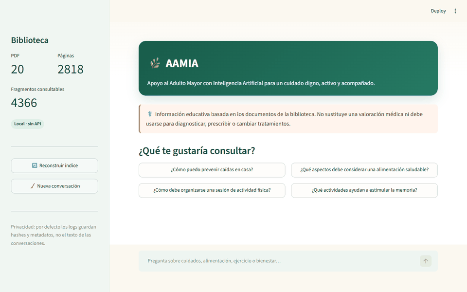
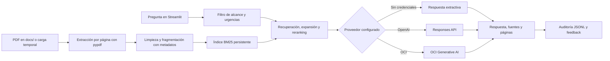
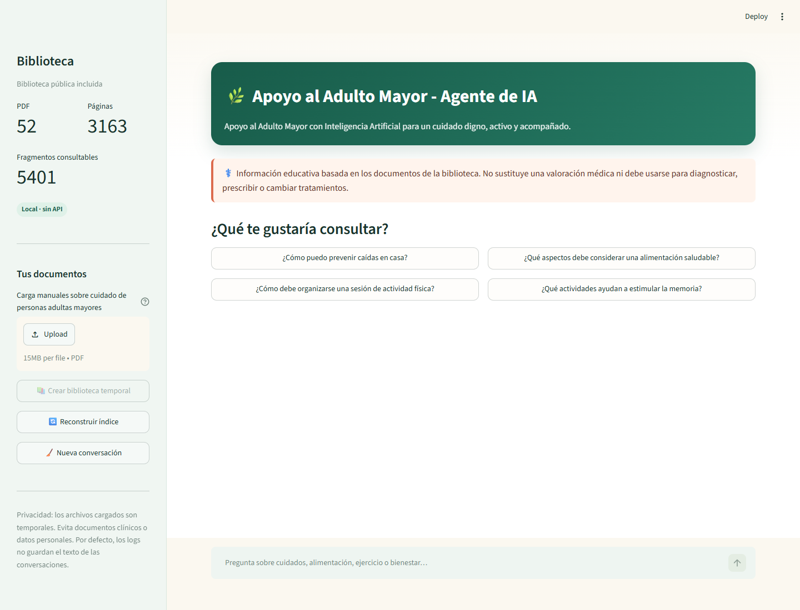
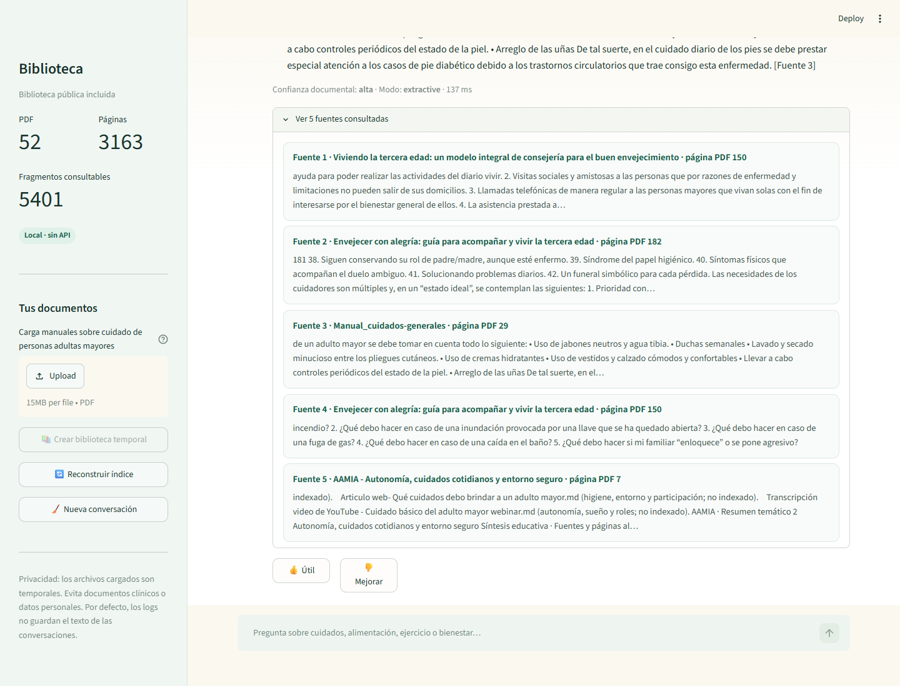

# 🌿 AAMIA — Apoyo al Adulto Mayor IA

Agente RAG en español para consultar documentos sobre el cuidado de personas adultas mayores, con respuestas respaldadas por el archivo y la página PDF utilizados.


🌐 **[Abrir AAMIA en Streamlit Cloud](https://challenge-alura-gente-aamia.streamlit.app/)**

> **Aviso:** AAMIA ofrece información educativa basada en los documentos cargados. No diagnostica, prescribe ni sustituye una valoración médica. Ante una posible urgencia, indica contactar de inmediato a los servicios de emergencia locales.

## Demostración



La demostración muestra una consulta real en Docker, desde la pregunta hasta los documentos y páginas recuperados. ▶️ **[Ver el video completo en YouTube](https://youtu.be/m-19G62AS6g)**

## Problema y motivación

Buscar orientación en manuales extensos y dispersos puede ser difícil para familiares, cuidadores y equipos de apoyo. AAMIA convierte una colección de PDF en una biblioteca conversacional que facilita el acceso a la información sin ocultar su procedencia ni sustituir a profesionales de la salud.

El proyecto nace de mi experiencia cotidiana al vivir con mis abuelos y observar cómo la movilidad, la salud y la alimentación requieren cada vez más atención. También responde al envejecimiento progresivo de la población en México y América Latina: busca acompañar un cuidado digno con información accesible y respaldada por documentos.

## Funcionalidades

- Descubre e indexa automáticamente los PDF de `docs/` por página.
- Genera cinco resúmenes temáticos trazables y recupera evidencia con BM25, expansión de términos y reranking por diversidad.
- Permite cargar hasta 5 PDF de 15 MB en una biblioteca temporal y aislada por sesión.
- Responde con fuentes y páginas, rechaza preguntas fuera del corpus y prioriza avisos ante posibles urgencias.
- Funciona sin API key en modo extractivo o, de forma opcional, con OpenAI u OCI Generative AI.
- Mantiene historial y feedback durante la sesión, y auditoría JSONL sin guardar el contenido de forma predeterminada.
- Protege de forma básica frente a prompt injection documental y reconstruye el índice cuando cambian los PDF.
- Incluye Docker, health check, CI y una guía de despliegue en OCI.

## Corpus e ingesta

La validación local utilizó 47 PDF fuente y cinco resúmenes temáticos. Tres archivos Markdown sirvieron como contexto editorial y no se indexaron.

| Métrica | Resultado |
|---|---:|
| Documentos PDF | 52 (47 fuentes + 5 resúmenes) |
| Páginas revisadas | 3,417 |
| Páginas con texto indexadas | 3,163 |
| Páginas omitidas | 254 |
| Fragmentos consultables | 5,401 |
| Errores de ingesta | 0 |

El corpus depende del entorno:

- **Local:** usa los PDF presentes en la copia local de `docs/`, incluidos los 47 archivos fuente.
- **Streamlit Cloud:** solo usa los PDF versionados en GitHub. Los 47 archivos fuente están excluidos por `.gitignore`; la guía abierta es el único PDF confirmado y los resúmenes estarán disponibles cuando se envíen a la rama desplegada.
- **Carga desde la interfaz:** crea una biblioteca temporal por sesión; no modifica la biblioteca pública ni conserva los archivos al terminar.

Por ello, los resultados locales pueden diferir de los obtenidos en Streamlit Cloud.

## Arquitectura



La recuperación es local: `pypdf` extrae y fragmenta el texto, BM25 selecciona la evidencia y el reranker conserva hasta cinco fuentes diversas. Con `LLM_PROVIDER=extractive`, el sistema muestra las tres oraciones más relevantes sin usar un modelo ni generar costos de API. Si se configura OpenAI u OCI, solo se envían al modelo los fragmentos recuperados.

## Tecnologías y estructura

El proyecto usa Python 3.12, pypdf, BM25, Streamlit, Docker, Ruff y unittest. La generación opcional se integra con OpenAI Responses API u OCI Generative AI.

```text
.
├── app.py                         # Interfaz Streamlit
├── eldercare_agent/
│   ├── ingestion.py              # Extracción, limpieza y fragmentación
│   ├── retriever.py              # Índice BM25 y reranking
│   ├── uploads.py                # Corpus temporal por sesión
│   ├── llm.py                    # Modos extractivo, OpenAI y OCI
│   ├── service.py                # Orquestación del agente
│   ├── safety.py                 # Alcance, urgencias y aviso médico
│   └── audit.py                  # Trazabilidad y feedback
├── docs/                          # Base documental
├── scripts/                       # Indexación y smoke test
├── tests/                         # Pruebas
├── deploy/oci/                    # Automatización y guía OCI
├── evidence/                      # Evidencia visual
├── Dockerfile
└── compose.yaml
```

## Ejecución local

### Windows PowerShell

```powershell
py -3.12 -m venv .venv
.\.venv\Scripts\Activate.ps1
python -m pip install -r requirements.txt
Copy-Item .env.example .env
streamlit run app.py
```

### Linux o macOS

```bash
python3.12 -m venv .venv
source .venv/bin/activate
python -m pip install -r requirements.txt
cp .env.example .env
streamlit run app.py
```

Abre <http://localhost:8501>. En el primer arranque se crea `data/index/bm25-index.json.gz`; con la colección local completa tarda cerca de un minuto y luego se reutiliza. Los PDF escaneados necesitan OCR previo.

También puedes consultar estadísticas, hacer una pregunta o ejecutar el smoke test desde la terminal:

```bash
python -m eldercare_agent.cli --stats
python -m eldercare_agent.cli "¿Cómo debe organizarse una sesión de actividad física?"
python scripts/smoke_test.py
```

## Configuración del modelo

El modo gratuito y predeterminado no llama a servicios externos:

```dotenv
LLM_PROVIDER=extractive
```

Para usar OpenAI:

```dotenv
LLM_PROVIDER=openai
OPENAI_API_KEY=<secreto>
OPENAI_MODEL=gpt-5.6-luna
```

Para usar OCI Generative AI:

```dotenv
LLM_PROVIDER=oci
OCI_GENAI_API_KEY=<secreto>
OCI_GENAI_REGION=us-chicago-1
OCI_GENAI_PROJECT=ocid1.generativeaiproject...
OCI_GENAI_MODEL=openai.gpt-oss-120b
```

Consulta la [guía oficial de modelos de OpenAI](https://developers.openai.com/api/docs/guides/latest-model) o el [QuickStart de OCI](https://docs.oracle.com/en-us/iaas/Content/generative-ai/get-started-agents.htm). Nunca publiques `.env`, API keys, tokens de OCIR ni llaves privadas.

## Pruebas y calidad

```bash
ruff check .
python -m unittest discover -s tests -v
```

La validación incluye 16 pruebas unitarias y de integración, un smoke test temático, el health check `/_stcore/health`, una prueba de interfaz con carga de PDF y la ingesta de los 52 documentos sin errores.

## Docker y despliegue

```bash
cp .env.example .env
docker compose up --build -d
docker compose ps
```

La imagen se ejecuta sin privilegios en el puerto `8501`, incorpora los PDF existentes en `docs/` y conserva índice y logs mediante volúmenes.

La aplicación está desplegada desde `main` en **[Streamlit Community Cloud](https://challenge-alura-gente-aamia.streamlit.app/)**. Para OCI, la opción gratuita recomendada es una VM `VM.Standard.A1.Flex` con 1 OCPU, 6 GB de RAM, Ubuntu, Docker Compose y `LLM_PROVIDER=extractive`. Consulta la [guía completa de despliegue en OCI](deploy/oci/README.md).

## Seguridad y límites

- Las respuestas dependen de la calidad y vigencia del corpus; las páginas sin texto se omiten.
- No deben cargarse expedientes clínicos ni documentos con datos personales o sensibles.
- El modo extractivo puede conservar rasgos de redacción del documento.
- Las citas usan la página física del PDF, que puede diferir de su numeración impresa.
- La detección de urgencias es preventiva, no un sistema de triaje clínico.
- `LOG_CONTENT=false` evita guardar preguntas y respuestas completas; solo debe activarse con una política de privacidad adecuada.

Consulta [SECURITY.md](SECURITY.md) para conocer las medidas implementadas o reportar vulnerabilidades.

## Evidencia
#### Pantalla inicial

#### Respuesta con fuentes

#### Detalle de documentos y páginas


## Licencia

El código se distribuye bajo licencia MIT. La guía de AAMIA incluida en `docs/` usa CC BY 4.0.
